2017-08-25 **|** 邓巍巍 **|** 来源 微信公号“知社学术圈”2017-08-24 **|** 39960

**作者介绍**

**邓巍巍** 1995年考入清华大学工程力学系，1999年取得学士学位，2001年取得硕士学位。2008年在耶鲁大学机械工程系获博士学位，随后在耶鲁大学任博士后和讲师。2010年受聘于美国中佛罗里达大学机械和航空系任助理教授。2015年加入弗吉尼亚理工大学任副教授并获得终身教职。2016年12月入选第13批国家“千人计划”。现为南方科技大学力学与航空航天工程系教授、博导。

**第一回**

**大过年的，辞个职吧**

我如约来到系主任办公室外间时，他的秘书白兰地正站在高脚桌电脑双屏幕后面。系里从去年兴起一个潮流，不少老师加高了桌子撤掉了椅子，直接站着办公。白兰地见我微笑道：“来啦？”我点头还笑，她敲了敲套间的门探头进去说：“巍巍到了。”

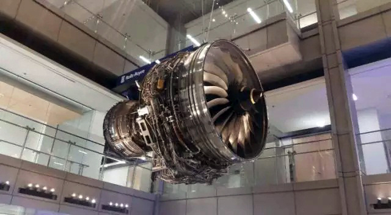

弗吉尼亚理工机械系系馆里悬挂的劳斯莱斯喷气发动机 Trent 1000，两个这样的发动机驱动波音787 Dreamliner

两周前就和白兰地约见系头的时间，她把我们的可选时间一对，最早的重叠是美东时间1月26日11点，恰逢中国农历年三十的凌晨。进屋之后，见系头也站着在高脚桌双屏幕后，他脚下还有一个像传送带一样的小跑步机。他让我坐下等他发完手边一封邮件，不久他从跑步机下来坐到我对面。

之前我们就谈话的内容已经有邮件沟通，于是直奔主题，意译下来是这样的——

系头：“你想回中国？”

我说：“对，这个机会很有吸引力，也对系里的国际交流有好处。我希望最好能停薪留职。”

系头：“我直说吧：我99%是不会答应你停薪留职。我需要你全时在这里，教书科研拿钱。你、我、他们是系里的新鲜血液，但不能体外循环。我希望你能重新考虑。”

他指指白板上贴的系里过去两年新进九个教授的介绍明信片，我和系头都是其中一员，都在明信片的证件照上西装革履地微笑。

我说：“谢谢您的坦率和好意。我也不兜圈子。我去意已定，停薪留职的主要目的是把剩下的几个学生带到毕业。”

系头：“你这个方向系里缺人，不空出位置就没法招人。你可以把学生过继给这边的老师，你做兼职教授就可以做共同导师。但是你要想清楚啊，终身教职何其宝贵，有人梦寐以求却没有拿到，比如贾老师。”

我有些意外：“是吗？”

他点头：“更麻烦的是，因为贾老师要走，他爱人方老师恐怕也留不住了。”（贾老师和方老师都是美国人，这里只是取了他们名字发音的第一个字。）

我唏嘘不已：方老师是正教授，和我方向接近，当时就负责招聘我这个职位，自始自终都像大姐姐一样友善。"非升即走"是终身教职制度最残酷之处，这样的命运降临在共事一场的熟人身上，谁都免不了兔死狐悲的感伤。

此刻我也更理解系主任凝重的眉头：我和方老师都教流体力学这门本科生基础课，我们若同时离开将令系里排课都捉襟见肘。

然而经历了半年多酝酿成的决心是不可能在此刻溶解的。我说：“想好了。我准备辞职。”

走出系办，我不禁感慨：人生如戏，“大过年的辞个职”这种春晚小品的桥段是的的确确在自己身上发生了。

**第二回**

**你从哪里来？**

辞别系头已经是接近中午。我约了同事小陈一起吃午饭。小陈和我不在一个系，反倒使有些事情交流起来更方便。他办公室和Norris Hall相连，离吃饭的地方更近，我就先步行穿过半个校园去找他。弗吉尼亚理工(VT)虽然是公立大学，但校园建筑和谐古朴，给人一种厚重的私校感觉。这也是因为校方多年来注重新旧建筑风格的统一，连外墙都规定必须使用指定的藏青色Hokie stone。

尽管是冬日里，在路上看到的许多学生仍是只穿着单薄的衣服。他们年轻，新鲜，火力足，就是可以穿得这么任性。他们步履轻盈毫不犹豫，似乎对前进的方向一清二楚。然而跟学生打交道多年之后，我知道他们会猛然发现大学生活如此之短，不久就要面临毕业与就业，挫折和打击会接踵而来。在入学时的美好憧憬与毕业时艰难现实的鲜明对比之下，他们中的很多人也将面临保安和哲学家都会问的三个终极问题：“你是谁？你从哪里来？你要到哪里去？”

而这些问题是极不容易回答的。经常当别人问“你从哪里来”，哪怕简简单单字面意思都要让我停顿想一想，联系当时的上下文，猜测对方是到底问什么。祖国还是祖籍？居住城市还是工作城市？本科学校还是博士学校？有时候搞不清楚对方意图还要先反问一句：“你又是从哪里来？”然后视对方回答来对等提供答案。

在美国的这十多年，我居留的地方北至康涅提格州的新港，南至佛罗里达的奥兰多，中至弗吉尼亚州的黑堡。无论我回答来自任何一个地方，对方通常都会说：“哦，你那里发生过枪击案。”这是事实：2016年奥兰多夜店枪击案50人遇难；2012年康州新镇小学枪击案26人遇难；2007年VT枪击案32人遇难。

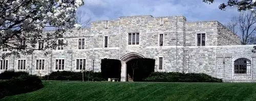

2007年VT枪击案发生地：Norris Hall

走到了NorrisHall，那是一座典型的大学建筑，庄重古朴。时间在不知不觉中抚平了一切表面的创伤，没有一点曾经的惨烈悲壮与惊心动魄。学生们鱼贯出入，忙碌地奔向食堂或课堂，有些孩子恐怕都不知道美国历史上最严重的校园枪击案就发生在这座楼里。十年前的一个早晨，一名韩裔学生怀揣三把枪和400多发子弹来到Norris Hall。他从里面把三个大门都用链条锁上，随后进入206和207教室突然开火，15名师生当场遇难。凶手试图进入204教室时，力学系Librescu教授闻声果断把门反锁并指挥学生跳窗逃亡。愤怒的凶手朝门猛烈射击，Librescu教授拼死顶住教室大门，为22名学生成功逃生赢得了宝贵时间，而他自己身中五弹遇难。

Librescu教授做出如此壮举的时候已经是76岁。经过这里我常忍不住想象，如果当时换作是我的教室，自己会怎样做？我很清楚，不到四十岁的自己恐怕没有勇气去冲在最前面，因为在这个年纪牵挂的、未竟的、未经的都太多太多。但若真是在已过古稀接近耄耋之年的时候，倒极有可能冲上前去给生命奏响最后一个响亮的音符。人的想法、做法和终极目标与生命时间轴有巨大的关系。什么年龄就该做什么样的事情。辞职是件有冲动成分的事情，而再不冲动就老了。

**第三回**

**洛阳亲友如相问，就说我在写基金。**

走进小陈办公室，小陈边笑着跟我打招呼边起身披上外套。小陈是第二年的助理教授(AP)，标准的学术小鲜肉：三十出头，正是雄心勃勃意气风发的年纪；聪明能干，清爽夏普，举手投足都散发出AP的典型双重气质：骄傲与焦虑。

AP完全有理由骄傲。在美国找教职竞争非常激烈，每个AP的位置都有上百人申请，几乎个个都是一路名校加好文章若干。经过电话面试、校园面试全方位考察之后，最终突出重围拿到聘书的基本上都是综合素质出类拔萃的幸运儿。

AP完全有理由焦虑。入职之后六年的终身教职倒计时(tenureclock)就开始了。这就像要拆一个定时炸弹，如果六年考核不达标，终身教职的梦想会被炸得灰飞烟灭。这些指标包括带研究生，教学，发表文章，以及斩获研究基金。AP对写文章驾轻就熟，带学生和教学只要花些时间也不是问题。分量最重也最难的是获得真金白银的基金支持。VT这一档州立学校工科AP要拿到一百万美元才算过及格线。如果不做医学或者国防研究，在美国主要靠自然科学基金(NSF)。一个NSF项目从三十万到五十万美元不等，也就是说一个AP要拿到两个NSF再加上其他一些小钱心里才踏实。而NSF的资助率逐年走低，过去几年都徘徊在10%左右。这些数据摆在一起，再加上脑海中嘀嗒嘀嗒的tenure clock，再阳光自信的男孩也难免偶露愁容。

小陈书架上摆他三口之家的温馨照片。他儿子现在两岁多。我做AP第二年的时候女儿也是两岁多。小陈太太工作在外地，开车要三个多小时。我和媳妇也是聚少离多，远的时候隔好几个州，直飞也要两个小时；现在虽然在一个州，开车仍要两个多小时。这就是典型的AP面临的工作之外的挑战：孩子在牙牙学语蹒跚学步，配偶通常也是高学历并有自己事业追求却很难在同一个城市找到相应工作。看到眼前的小陈就仿佛见到了六年前的自己。

坐下吃饭时小陈第一句话就是：“我的NSF被拒了。”我必须安慰他，因为六年前的自己也是曾经需要安慰的。根据我积累多年的求安慰、被安慰、安慰人的经验，我知道安慰一个觉得自己惨的人很管用的一招就是讲自己也曾经惨过。于是我开始给小陈讲我的第一次NSF被拒的经历。

那是在我入职不久，正是踌躇满志之时，写第一个本子像蜜月期的新媳妇做针线一般，呕心沥血花团锦簇爱不释手。本子投出去之后就每天刷屏多次查状态，从孤芳自赏到自怨自艾，逐渐陷入怨妇状态，直至看到系统里显示猩红的“Declined”终于变成了绝望主妇。恼羞成怒之下啪地合上电脑冲出门透气，刚巧碰到了周老师。周老师是传热学领域响当当的名字，学术与行政俱佳，做过系主任和工学院院长，德高望重，深受大家爱戴。见到他慈祥的样子，我第一句话就是：“我的NSF被拒了。”那时的委屈无助，简直就差扑到他宽阔的肩膀上哭泣了。深谙安慰之道的周老师带着他一贯和蔼的笑容缓缓地道：“我前七个NSF都被拒了。当时我都想不干了。”我目瞪口呆：周老师出道是三十年前，NSF要比现在容易许多。况且周老师的博士导师乃是华人学界中的泰山北斗、伯克利前任校长田长霖先生。他如此显赫的学术出身都要经过这等打击，我也迅速平衡且平静下来。

望着小陈略微放大的瞳孔，我继续讲：历史就是那么惊人地相似，我也是经过七次无情拒绝，直到第八次才中。这个“中”字实在是再贴切不过：不管当年高考、申请出国、找工作、甚至生娃，都没有如此强烈的“中”的感觉。面对我中基金后的痴笑，媳妇曾不屑地道：瞧你范进那小样。(她没想到的是，三年之后媳妇也做了AP，中了第一个基金仰天长笑的表现与我当时并无二致。)

小陈若有所思，想必对“任重道远”又有了新的认识。午饭后走在回办公室的路上整理着关于基金与海归的思绪。过去三十年美国NSF预算都没有本质变化，多年维持在60亿美元的水平，完全赶不上通货膨胀；相比之下，三十年间中国国家自然科学基金(NSFC)预算增加了300倍达到240亿人民币，很快要与美国持平。在中美基础研究投入此消彼长的趋势下，华裔教授纷纷把视线转向国内，寻找中美学术合作与交流机会。所以过去几年我也积极与南京和西安的几所大学拓展合作，有了初步成果之后就开始考虑写合作申请中国的基金。

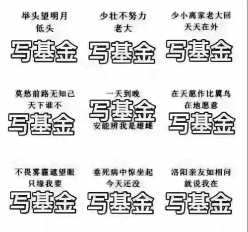

去年三月初是我的春假，我飞去南京与长期合作的一个教授写海外合作基金。每年三月十号左右是NSFC最后冲刺的阶段，整个中国学术界都在聚精会神忙这一件事，见到熟人三句话之内也要绕到基金上来。关于基金有许多段子，比如不论什么千古名句，后半句扯上写基金似乎都合适：

举头望明月，低头写基金。

少壮不努力，老大写基金。

夜夜思君不见君，原来君在写基金。

垂死病中惊坐起，今天还没写基金。

待到山花烂漫时，她在丛中写基金。

我最喜欢的一句则是：“洛阳亲友如相问，就说我在写基金。”这不仅仅因为我是洛阳人，更因为在宁的几位洛阳老乡的帮助促成了我去年暑假被聘为南京一所大学的兼职教授。这使我出国后第一次有整整三个月时间在中国，获得了足够充分的机会去深入了解国内高校发展的现状与机遇。

**第四回**

**学术的江湖和桃花岛**

有人的地方自然就有江湖，而学术圈与江湖有尤其多共通的特质。

比如，学术圈与江湖的核心关系都是师徒。

比如，学术圈与江湖出道之前都要经过多年艰苦卓绝的修炼。

***比如，学术圈和江湖中的女弟子都通常要吃香一点**。*

比如，学术圈与江湖都喜欢时不时开个英雄大会，台上走马灯似地秀，台下或喝彩或质疑。

比如，学术圈与江湖都讲究出身、门派、辈份、名号及地位。

比如，学术圈与江湖都是要闯荡的。

在这个和平年代，一面是绝顶高手的稀缺，一面是学术繁殖空前迅速，十年就可以是一代，论文数量更是呈爆炸增长。现在行走于学术江湖的绝大多数人都非天赋异禀，要靠互相帮衬不拆台日子才比较好过。一篇文章或者一个本子投出去，也和古时候走一趟镖差不多：想要有惊无险平安送达，得仰仗朋友拔刀力挺，也得靠各路豪强时不时卖个面子。这里面三分靠实力，三分靠名号，三分靠行走江湖拜访各路神仙留下的善缘。在中国如此，在美国也是如此：周老师曾对我讲，作为助理教授，你如果没有三分之一的时间在外面跑是很难成功的。从这个角度看，“读万卷书，行万里路”对于高校教师更加有针对性。于是，经常出差是必须的，去让人家邀请自己去做报告也是必不可少的。

在南京期间，我向国内几个大学发邮件求被邀请做报告，争取机会宣传自己的工作并结交同行。其中一封邮件发给了南方科技大学力学与航空航天系的系主任。系主任对我的毛遂自荐表示欢迎，很快定下了时间，就在五月底。我随即又联系求见南科大校长，他也正好有时间见我。

南科大2011年成立于深圳，自诞生起就备受瞩目也不乏争议。五年多来发展势头极为迅猛，仅从高考招生分数来看，南科大已经达到985高校中游水平，对这所年轻的学校来讲实属难能可贵。南科大创校校长是原中科大校长朱清时院士。读相关的众多报道，印象最深的是朱校长卸任时以“惨胜”二字概括自己的任期，创业的艰辛种种既溢于言表又尽在不言中。2015年底陈十一院士成为第二任校长。陈校长是华人学界中极为罕见的在中美两国主流大学都有高级行政经验的人物。他曾任霍普金斯大学机械工程系系主任，随即在北大创办工学院，之后任北大副校长。他也是学术水平毋庸置疑的院士科学家：做为周培源先生的关门弟子，他在湍流与格子玻尔兹曼方法领域的建树影响深远。从学科互补的角度来看，如果说由于朱校长是物理学家，他所建立的学科有极深的理科烙印的话，那么陈校长的工科背景使南科大增添了新鲜的工科色彩，其中力学与航空航天系就是其中浓重的一笔。

到深圳那天下着毛毛细雨。先见到了系主任，他于常青藤名校获得博士，有在美国顶级国家实验室和公司工作的丰富经验，四年前以千人计划专家身份回国。他为人大气热情，给我介绍系里的情况和发展规划后就带我去见校长。

陈校非常健谈，而且因为领域相近，共同话题不少。巧的是，我的大学同班同学、宿舍下铺的兄弟、婚礼的证婚人王教授曾是陈校在霍普金斯大学时期的博士后。王教授是我见过的聪明人中最勤奋的，勤奋的人中最聪明的。他在美国曾获得国家实验室奥本海默学者的殊荣，后来成为中组部首批青年千人，并回母校清华做正教授，是同学们都为之骄傲的。陈校思路敏捷，问问题和答问题都是一针见血，几句话问下来就对我的情况把握得颇准。陈校说你来南科大吧。我以为他随口一说，答道这个不容易，我们家有two-body problem。陈校摆摆手：这在别人那里是problem，在我这儿不是问题；给你们俩一起解决，将来想跑都跑不了。随后他挑重点讲了相关海归政策、科研条件、个人待遇，我把听到的几组数字迅速除以七换算成美元，意识到这些条件放在美国一流学校也是非常有竞争力的。但是我已经在美国经营多年，得到终身教职之后是打算陪伴终身的，全职海归这样的大动作还不可想象。陈校并不理会我的犹豫，说你可以先申请青年千人，拿到之后再做计议。

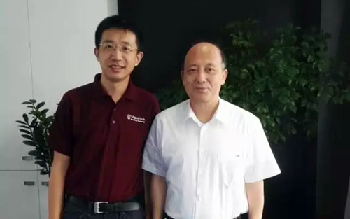

与陈十一校长合影

辞别陈校，系主任又带我逛了逛校园喝咖啡。五年前这里还是一个村庄，现在唯一留下的痕迹就是图书馆前的一棵根深叶茂的老榕树。中学课本里读到的深圳速度现在就活生生呈现在面前。校长描绘的美丽蓝图，眼前真切的日新月异，以及除七前后的各个数字都在我脑海中盘旋。更神奇的是，不知为什么，在学术的江湖飘泊了这些年，忽然来到这里，非但不觉得陌生，反而有一种置身桃花岛的舒适感觉，想在这里歇脚停留。那一刻，嘴角微微一笑，心中微微一热，一个小火苗冉冉升起。我对系主任说：要不，我们先申请个青千试试看？

**第五回**

**人才的标签**

陈校谈话时还说了句话令我印象深刻：如果不想当院士就不用来南科大。

院士是学术界的崇高荣誉，而中国的院士更是世界上拥有最多科教相关话语权及连带利益的，没有之一。近年来，学术界对通往院士评选的一些里程碑认识逐渐趋于统一。认识统一的一个始料未及的结果是前续步骤也被公认变得清晰，并随之标准化。这个过程每迭代一次，起跑线就被往前划一步。

有意思的是，在国内跟上海、江苏的同学们聊天的一个主要话题是：优质教育资源的稀缺使孩子们的起跑线也是逐渐前移，导致幼升小都如临大敌。在Gladwell写的里举过加拿大职业冰球运动员选拔的例子，道理也是一样一样的：在每一年龄段出众的孩子会被选为下一年的重点培养对象，享有更好的教练、更厉害的对手、更多的比赛机会，从而更早地保质保量攒够一万小时成为冰球精英。这样逐年往前推，直到最早选拔上的孩子都是春天出生的，因为他们的生日最接近报名截止日期(1月1日)，在起步时拥有最大允许年龄带来的最好体能。我猜一定会有打鸡血的加拿大夫妇以早春时节为目标生日来倒推备孕制造冰球宝宝吧。

按这个趋势，院士和高考已经几乎可以对接起来。半开玩笑来讲，也许若干年后院士的典型养成路线从高级到初级大致是这样：

院士，长江学者，杰出青年基金，优秀青年基金，青年基金，百佳博士论文，名牌大学，省重点高中，市重点初中，区重点小学，奥数小神童，幼儿园小天才，胎教积极分子，优生优育标兵。

这里最接近金字塔尖的长江学者和杰青也是含金量最高、竞争最激烈的人才计划。我对人才计划的看法比较温和，认为它们的存在有其现实及合理意义，因为大众无法在瞬间评判一个学者的大致水平。各种人才计划类似产品认证，选拔通过的人才就可以戴上这个标签。如果选拔过程靠谱，相应产品也没有砸标签的牌子，口碑就可以逐步树立起来了。这种方式远非完美，但恐怕是目前能获得效率与相对公平的不得已之举。人才计划和第一学位的情况类似：高校的985和211标签虽被广泛诟病，但把任何人放到招聘主管的位置上，面对海量简历和有限的资源，想迅速进行第一轮筛选，查找985和211标签是可以做到八九不离十的唯一办法。

杰青是基金委主持选拔，每年200人。长江是教育部主导，狭义的长江特聘教授(不包括讲座教授和青年长江)每年约150人。考虑到长江和杰青还有近一半的重叠，所以两大荣誉虽然权威但数量稀缺，远不能满足泱泱大国对各种人才认证服务的需要。而中国既不缺人才也不缺名山大川名水大河，各省市也纷纷推出黄河学者、泰山学者、楚天学者、天山学者、闽江学者、赣江学者、珠江学者等等。武汉大学原校长刘道玉曾统计类似名号有38个之多。这些名号虽然使标签数量增加，但评审过程和标准都不一致，认证结果也缺乏全国流通的效力。

于是就顺势产生了国家层面选拔评估的、兼顾数量与质量的人才计划。这就是由管干部的中组部推出的海外高层次人才引进计划，又称千人计划。实施近十年来，千人计划逐渐清晰地定义了海归的套路：

正教授可以走千人计划(大千或国千)，国家只要求“原则上”每年六个月在国内工作。这样大千人的海外位置可以不放弃，只利用寒暑假春假秋假学术休假等时间就可以保证六个月的兼职。虽然有不少人批评某些大千人不全职在国内工作的情况，但我认为兼职一样甚至更加有意义。从充分发挥价值的角度讲，大千人的主要意义在于构建团队平台和把握科研大方向，用一半时间亲临指导另一半时间运筹帷幄于千里之外完全没有问题；而且保持海外学术界的存在对维持他们的国际江湖地位和双向学术交流也有很多益处，是使他们保值增值的方式。从实际操作来看，正教授的子女通常已经是在上初高中并深深植入海外文化与生活，强迫举家全职海归既不人道也不现实。

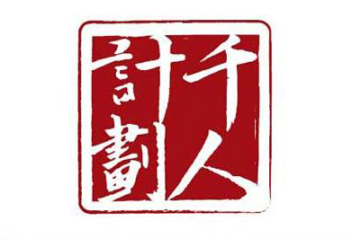

博士后可以走千人计划青年项目(青千或者千青)。中组部把“青年”的截止线划到40岁，并且要求有海外三年以上科研工作经历。青千必须全职，这是各个方面的共识，监督和实施得也颇严格。一方面是国家需要青年才俊在本土科研的第一线拼搏；另一方面博后通常只是三十挂零甚至不到的年纪，子女尚小或者干脆没有，后代教育对全职海归来说一般不构成一票否决。

而海外的助理教授和副教授(这里统称AP)则处在一个很尴尬的境地。因为从学术阶段来说，AP应该对标在大千和青千之间，而中组部并没有衔接这两者的人才计划。如果AP想海归，要么等三到十年升到正教授申请大千，要么现在去和博后竞争青千，要么就是没有帽子裸归。而裸归将失去很多配套资源，以南科大为例，有没有青千在科研启动经费上可以相差五百万人民币。

所以，有不少同行朋友跟我说：你申请青千是over qualify了，过几年直接申请大千吧。可实际上，几年时间听起来虽然不长，却是极其关键的几年：孩子在一天天长大，适应会越来越难；海归合适的位置也逐年减少，近年来有些顶级学校已经呈现饱和趋势。

初见陈校时我刚一个人过完39岁生日不久，将将可以追赶青千的末班车。一旦动了海归的心思，虽然嘴上说是申申看，但实际上已经是等不及、等不起、必须申、必须中的心态。

**第六回**

**三体**

见过陈校的那天晚上，我给地球那头的媳妇打电话讲了当天的见闻和回国的念头。

“What？海归？全职？今儿忘吃药了吧？”她在电话那头连珠炮似的问号辐射着强大的气场，虽千万里如妻亲临。她的反应我并不意外：一是因为她是典型的白羊座，二是因为海归是个陡峭的阶梯函数，必然会激起情绪的振荡。

“现在还只是初步想法……”

“你tenure怎么办？我怎么办？娃怎么办？”媳妇显然解读出我的想法并不那么初步，直接指出了问题的核心：三体。在美国换工作经常牵扯到的只是two-body problem，孩子跟着搬家影响还不算大；而跨国迁徙时则是硬要给娃在中西文化中长大之间选择一个，这使本来就复杂的情况更加难以理清楚。

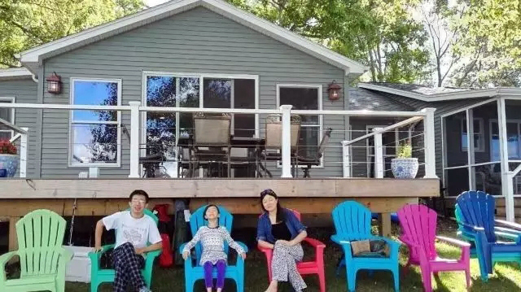

全家福

**媳妇对海归的立场至关重要，因为她是家里的No.1，对家庭事务决断可谓是一言九鼎、一锤定音、一票否决。**家庭地位和其他地位的获得类似，很少有偶然，多数是要凭实力和努力。媳妇和我是大学同班同学，也是我见过的智商与身高乘积最高的女生。从大一开始她成绩就一直比我好。比如学线性代数的时候，我对这个以前没见过的数学新物种简直是一头雾水，想问问题都找不到北，只能很羡慕地看她下课后和老师讨论切磋谈笑风生。她思维之敏捷和非线性常令我十分佩服。我读博士的时候有一阵子实验很不顺利，因为一台关键的水冷激光经常在取数据的关键时刻罢工，折磨得我百思不得其解，逢她便像祥林嫂一样抱怨：我这个激光真是怪，白天两三分钟就停工，晚上和周末则好一些。她头都不抬说：“可能是因为有人冲厕所吧。”我将信将疑约了实验室的小伙伴做了冲水测试，果然那边一冲水，这边水压就骤降，激光水冷失效就引发断电保护。于是我重接了独立水路，这个问题迎刃而解。

她的硕士论文题目是关于哈雷摩托车的风冷散热；虽然哈雷是美国文化的一个标志品牌也是大家都觉得很酷的课题，她感到这并不是自己将来想做一辈子的方向。读博士的时候她去医学院找老师谈，其中一个做核磁共振成像的教授跟她介绍了用MRI诊断肝硬化的课题。她告诉教授她可以利用流体力学模型从肝脏血液流速推出压力变化，这个值会和肝硬化程度正相关，可以做为定量诊断依据。教授有些兴奋，但紧接着问那大人和小孩肝大小不一样可怎么办；媳妇秒回：拿肝的体积除一下(normalize)就好了。教授两眼放光，当即招她进实验室，她也华丽转身切入到前景和钱景俱佳的生物医学工程专业。她的简历还包括在克里夫兰医院(全美排名第二)和美国药监局FDA(美国1/5的产业GDP都由FDA直接或间接监管)的工作经历。她现在是弗吉尼亚大学(UVA)医学院的助理教授。UVA侧重文医法商，在全美公立大学中综合排名长期占据前三，甩VT几条街。有这么一个媳妇，我在骄傲倾倒之余，既倍感压力也平添许多动力。

“你倒是说话呀？“媳妇在电话那头催道。

“你过两个礼拜不也就回国度假了吗？我们一起去深圳转一转，看看情况再说。你如果很不喜欢那个地方，我也就不再提这个事儿了。”我建议，她同意。

两周后我和媳妇来到了南科大。力学系的系主任出差了，是机械系系主任融老师接待我们。融老师是大千人，在美国做了多年Chair Professor，人特别好，在夏至前后的大热天带我们在校园散步，在展览室指着沙盘介绍情况，给予我们很多鼓励和正能量。媳妇很感动也很感慨：在美国是公事公办，人与人之间礼貌背后透着冷漠；而融老师给人如沐春风的舒适感觉，和这样的师长共事一定会很和谐愉快。

因为考虑娃的教育，我们去参观了两所国际学校。设备的确很新，学费也与美国私校看齐，但除此之外感觉不出什么特别的地方：高中部毕业生考上的大学不算出众，学校追求利润的气息尤其浓重。最后去看了公立的南科大附属实验小学，反倒眼前一亮。因为是新小学，最高的班级只有三年级。带我们参观的老师低调务实；教室的桌椅设置活泼科学；学生们看起来也很开心。用起technology比娃在美国的小学更甚：每个学生要求配有iPad，而且要求打字每分钟至少若干字。走道的柱子上贴着许多基于学生艺术作品的海报，风格多样，有些水准颇高。顶楼有个漂亮温馨的玻璃暖房，里面有各种花花草草，是一个教学生欣赏植物和自然的好去处。最让我有共鸣的是学校中心位置的墙上贴了一副巨大的调色盘一般的《多元智能示意图表》，用中英文说明八种智能(intelligence)：人际，内省，韵律，身体，语言，数理，自然，空间。我和媳妇对望一眼频频点头。在这个显著的位置宣扬这种理念说明学校的价值观非常现代且科学。娃在这里上学我们多半是会放心的，担心的恐怕是中文一时半会跟不上。

媳妇在国内期间我们还一起跑了其他几个大城市，而她最喜欢的还是深圳。度假结束，送她去机场。临别时她神情复杂地说：“我这次是想找一个明显的否定你回来的理由。可是，我没有找到。”

**第七回**

**七种武器与三生三世**

海归的初步想法没有被否决，我便开始准备青千的申请材料。里面一项重要的内容是介绍学术贡献，篇幅只有小四号字两页，这需要对十年来的工作进行高度浓缩和概括。把事情复杂化并不难，比如你问我研究的是啥，我可以深吸一口气回答：我专注于微小射流在表面张力导致的静脉曲张型失稳和带电后由于麦克斯韦应力引发的鞭型抖动失稳而分裂产生的液滴极其多组分蒸发机理以及与基板的冲击相互作用。你此时有没有感到胸闷并想大喝一声：说人话!但是，要把专业的事情讲得深入浅出是不容易的。另外，写学术贡献这部分要用中文，才发现用什么语言写不重要，思路清楚才是关键。于是，我把这当成一个整理思路、审视过去十年的机会。定期的自我审查非常有必要，好比苏格拉底曾说：“不自醒不如死翘翘”(The unexamined life is not worth living)。

前面讲到学术圈如同江湖，而想在江湖闯荡出些名堂一件独门武器是必须的(绝顶高手除外)。诺贝尔奖在某种意义上并不是颁给某个人，而是奖给一种横空出世的武器，无论是1901年最初获奖的X射线到2016年的超分辨率显微镜。每个在学术江湖行走的青年都应该问自己，我应该专注修炼哪种武器，以至于将来那件武器就成为自己的代名词？是长生剑，孔雀翎，碧玉刀，多情环，霸王枪，离别钩，还是小李飞刀？

我修炼的是一件冷门兵器，名唤泰勒锥(Taylor cone)。此锥是由液体在电场(重力场或压力场也可以)下幻化而成。泰勒锥尖锐异常，世间武器无人能出其右。而从锥尖喷薄而出的是细如毫发的液体射流。此锥依据一代流体力学宗师泰勒命名，因为他用理论算出了锥的角度。我博士论文的贡献主要就是打造了泰勒锥的加强版，一出手可以同时使出几百个泰勒锥。

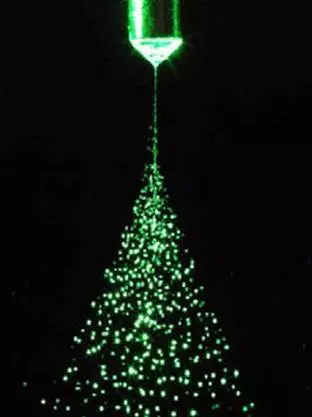

泰勒锥

而武器只是手段，最终还要为目的服务，或报仇雪恨，或除恶扬善，或追名逐利，或替天行道。那么我为什么要修炼这么一件诡异的兵器？因为泰勒锥可以来主宰液滴的三生三世。

液滴随处可见，这种玲珑剔透饱满丰盈的球形液体状态可以看做是今生。不同液滴在肉身(溶液)抽离之后会有不同的结局：一滴滴小小的墨水落在纸面上可以拼成文字或图画，一滴滴牛奶挥发之后可以成为更好保存的奶粉，一滴滴像蜡泪一样的液体固化排列可以形成新的三维形状，一滴滴混着农药的溶液附着在绿叶红果上可以成为保护膜和残留，一滴滴鲜血或咖啡溅落干透后可以成为醒目的圆环……这些结局就是他们的来生。想要获得自己渴望的结局就要有对应的今生，而今生则是由前世注定。液滴的前世也可以是多种多样，其中一种简洁的出身是射流，肉眼可见的比如从莲蓬头出来，看不见的则可以从泰勒锥产生。射流表面是相当光滑的，可以是分子级一般平整无瑕。而射流光滑表面的背后是敏感不淡定的，一点点扰动都可以被其感知。射流又像一根流动的琴弦，遇到合适的频率便会去拼命共鸣，鼓出来一连串会跳动的凸起，直到弦断，分裂成一个个小液滴，至此完成从前世到今生的蜕变。很多液滴在一起可以变成雾，因为这个缘故，江湖上听说静电喷雾要比泰勒锥多的多。

我的研究，就是手持一把泰勒锥来精心筹划安排小液滴的前世、今生和来世。注意这个“精”字，我相信，正在成为一个越来越重要的关键词。这是因为当物质和信息都极大丰富乃至严重过剩的时候，“精”字是供给侧针对选择困难必须要做出的改革。比如吃饭，上大学的时候主要是在意分量足管饱，而现在是看整个体验是否愉快。一个在上海的高中同学携老公女儿招待我和娃吃饭，她名字里带个“Yan”字，选的地方叫“宴遇”：灯光昏暗鬼魅透着暧昧；桌上摆的湿纸巾包装是四四方方盈盈一握让人不禁莞尔；餐前送来一个冒着青烟的匣子，里面每人一小盅饮料，但有一位会拿到让舌头变黑的“毒酒”；每道菜都摆着有趣的造型；餐后的果盘是枝头点缀着几颗水果的小树杈。这已不是简单的宴席——因为精致所以惊艳。不仅仅食不厌精，现在的影视作品的制作也日趋精良，至少是形式上的。一部长长的《琅琊榜》，几乎是把电视剧当作婚纱照来拍，摄影构图非常讲究，随便在哪里定格都让人赏心悦目。现在扶贫都讲究精准，“运用科学有效程序对扶贫对象实施精确识别、精确帮扶、精确管理”。习主席提出针对扶贫的“贵在精准，重在精准，成败之举在于精准”的判断也可以推广到其他领域。比如未来的医疗，说“贵在精准，重在精准”是一点也不为过的。

你可能会觉得从液滴扯到精准医疗不免有些牵强十分忽悠。其实不然。这里举一个我和两位汉姆顿大学药学院老师合作的例子。紫杉醇是历史悠久的一线抗癌化疗药物，但它敌友不分，对癌细胞和正常细胞一概格杀勿论，那么针对癌细胞的精准打击至关重要，所以“靶向给药”成为一个重要研究方向。除了主动靶向给药之外，人们还发现一种被动靶向作用：在肿瘤附近的血管壁面较正常血管稀疏，允许一百纳米左右的颗粒渗透出血管向肿瘤扩散，所以只要这些纳米颗粒可以持续循环，就可以被动地向肿瘤集中，称为EPR(enhanced permeability and retention)效应。一百纳米左右的尺寸相当关键，太大渗透不出去，太小则到处渗透也就没了靶向作用。一百纳米是头发直径的千分之一，如果想通过液滴蒸发得到这样精准的最终结局，只考虑今生是不够的，需要从前世就得开始精心筹划。我们就是这样做的，把紫杉醇溶解到特定的溶剂中，精确控制泰勒锥产生射流和喷雾，精心干燥后最终做到了非常齐整的一百纳米紫杉醇颗粒。

也许，若干年后江湖上会传说：谁让眼泪飞？巍巍泰勒锥！

**第八回**

**大学与书院**

“这是最好的时代，这是最坏的时代；这是智慧的时代，这是愚蠢的时代；这是信仰的时期，这是怀疑的时期……”《双城记》开场白的经典在于它捕捉的两面性在任何迅速发展变革的时期都适用。它可以来描述法国大革命，可以形容互联网时代，甚至可以概括大学生涯。而互联网时代的大学生涯更是良机和危机共同四伏的时期。互联网给高等教育带来诸多便利的同时也带来变革的压力，但我从不担心在线教育会取代真正的大学，因为大学远远不是录播一些公开课视频那么简单。大学（以及党校和商学院）最大的附加值是使人有机会和一群有才华有梦想的同龄人用人生中信仰与怀疑并存的几年去建立深度联系。也有父母把选择大学上升到给孩子选dating pool（找对象的池子）的高度。这两种想法本质是一致的：我们看中的不是大学的围墙和建筑，而是大学里的同伴和老师。

不论一个人的朋友圈名单有多长，普通人能够维持的真实朋友圈最多也就一两百人。这里“真实”是指能叫出名字、有深入了解、有过高质量的互动，一个电话打过去对方不会觉得突兀。下面这组数据可以作为佐证：天下英雄好汉无数，梁山聚义厅里只有108人；中国十多亿人口，开起中央委员会只有205人；美国三亿人口，参议院只有100人。根据所谓的六度分隔(Six degrees of separation，也就是任何一个人可以通过至多六个人认识世界上所有人)，把六十亿人口开六次方，那就是平均每人认识135人。也就是说，人际关系的重点在于质量而非数量，因为数量在一两百的时候就趋近饱和。（有趣的是，《海归记》在朋友圈的活跃读者大约100人，你若读到这里就说明你相当于是我的中委、参议员。）

所以，大约是因为强调人际关系的深层互动，美国私立名校都无一例外地推崇小班上课和高师生比。如果只算本科生，几所顶级名校的师生比都相当高：普林斯顿一比五，耶鲁一比六，哈佛一比七。在同样的指导思想下，剑桥、牛津和耶鲁甚至实行residential college制度（住宿学院制，简称书院)。比如耶鲁把五千多本科生分成十二个书院，配备由大牌教授直接参与的支持体系，包括院长（Master）、学监（Dean）、驻院学者和研究生Fellow。每所学院都会举办自己的特色活动和院长下午茶（Master′s Tea）。这样每个书院的同一个年级就只有一百多人，四年下来完全可以做到相互熟识知根知底。有朝一日，若某个同学要做一票事情，小至创业大至组阁，想搭班底之时脑海中已然有了自己的人才库。

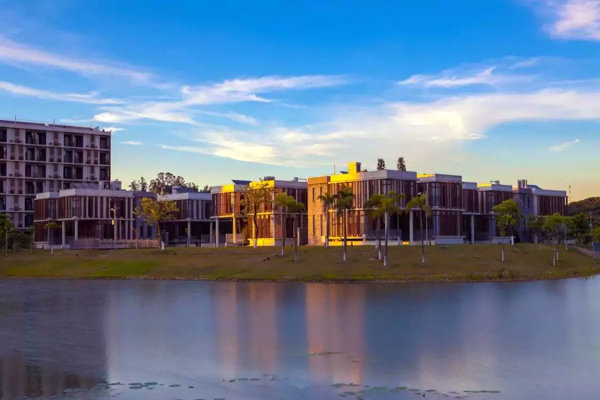

南科大湖畔的书院

南科大规划的是八百教授和四千本科生，师生比完全是朝常青藤看齐。创校校长朱清时把书院制作为全面教育的核心组成部分，现在设有致仁、树仁、致诚、树德、致新、树礼六个书院。各书院以学生公寓为核心，有自己的文化、传统、活动和社团。书院为每位学生分配一位教授为导师，为大学学习生活提供咨询意见。根据官网，书院“致力于促进学生在认知、情感、社会性等方面的多维度成长”，“营造一个关系密切、互动交流的师生社区。”这些理念我都极为认同，而且对南科大书院的真实状态也产生了浓厚的兴趣。

那天晚上，暮色四合凉风习习，我晚饭吃撑了于是在南科大校园里漫无目的地散步。手中没有地图，从专家公寓出来就顺着校河逆时针溜达。河那边影影绰绰是一片荔枝林，想到中午在食堂里刚品尝过南山的荔枝。走了不久，水域开阔起来成为一个湖，湖心有个半岛，上面错落有致分布着九座别墅。这是给院士住的，名叫九华精舍。“精舍”最初是指儒家讲学的学社，后来也指出家人修炼的场所，现在精舍多指都市人追求人生真谛而求学的地方。

与九华精舍隔湖相邻的是学生公寓，那几座楼的外墙配色与院士楼几乎一样。我离本科住校生活已近二十年，很好奇现在的学生们晚上在做什么，于是过了桥去一探究竟。来到的第一座公寓映入眼帘的是半埋入的底层，窗户与外地面平齐，里面是座位充足的自习室，三三两两的学生拿着笔记本电脑，但绝不是玩游戏，而是以此为工具查资料或看课件。旁边一座公寓底层则摆着好几张台球桌和乒乓球桌，也只有五六个学生在玩，球桌的闲置率很高。下一栋公寓的一楼很大一个房间里屋顶吊着几个飞机模型，架子上摆着若干3D打印机和其他常用的创客利器。果然，门上匾额写着“创客车间”。

除了作为学生公寓的几座高层，紧挨湖畔还有几座低矮的建筑，几乎四面全是窗户，里面灯光映出来在夜里像几个发亮的水晶盒子。这些湖景屋想必是书院的活动室了。有一个活动室里在举行一场讲座，看题目是和培养领导力相关的。第二个活动室里是在上现代舞课，台上一个很帅气的男生在左手右手分解示范一个慢动作；下面十几个学生，男女各占一半，很专注地跟着模仿重播。稍后节奏感超强的音乐响起，台上台下一起开始青春的舞动。在下一个活动室门口看到一个长发长裙女生正在俯身调整古筝的琴弦。从门往里望去，里面十几个学生在分别摆弄二胡琵琶笛子笙箫各种民族乐器。这应该是南科大著名的民乐团吧。正当我离开时排练开始了，第一次近距离听到现场民乐演奏，一时间真是鼓乐“轰”鸣，颇为震撼。

我继续散步，身后的民乐越来越远也越悠扬。我禁不住经常回过头来看那几个闪亮的水晶盒子。想起自己大学时代，竟有种莫名的心痛。那时自己在教室和图书馆间机械穿梭像一部按编好程序运行的学习机器，那种压抑和单调让记忆中的多数画面都是灰的暗的，以至于很少去主动回忆。我好羡慕现在的他们，羡慕他们可以被零距离的美好事物熏陶照亮：在宿舍楼下就可以选择打台球或上自习，在桥上就可以和院士和校长点头致意，在湖畔就可以起舞或抚琴。可以想象，如果自己也在这里度过大学生涯，记忆一定会像水晶盒子那般明亮。

**第九回**

**房子是最重要的吗？**

当然不是。

前些日子朋友圈被一篇《房子不是最重要的，爱才是！》刷屏（作者微信公众号“小万工”）。2008年毕业于清华建筑系的小万工在北京打拼近十年，负责设计操作多个楼盘，而今年携北大物理系毕业的老公和两个小娃返回武汉。文中充满了积极向上的正能量和对生活对家人的热爱。但很多清华毕业生在北京买不起学区房而撤离的确是不争的事实。

如果清华本科买不起一线城市学区房，那么清华本硕加耶鲁博士呢？答案是：更—加—买—不—起！原因很简单：国内飞速发展和房价飙升的那黄金几年我们都用来去读书了。一位扎根上海的同学直言不讳说我在国外期间错过了房地产红利。现在祖国强大了，一线城市的房子可贵了，远超美国中产阶级可以负担的水平。在美国，房子虽然是像积木加石灰板搭起来的，但是真心实惠啊。我们曾经居呆过五年的奥兰多也算是宜居的百万人口级的城市，有迪斯尼乐园、海洋公园和曾经辉煌过的NBA魔术队。当时买的是典型的四居室，两百平米使用面积，独栋前后院带双车库游泳池，步行距离到很好的小学。总价？不到两百万人民币，折合一万一平。再看深圳，其房价已处在厚积薄发的“发”的阶段：2010至2014年深圳商品房均价徘徊在两万一平，2015年突然翻倍到四万多，2016年均价到五万四，而南科大周围要八九万一平了。这个价格不见得是泡沫，因为年轻、高收入人口源源不断涌入的刚需。深圳面积不到弗吉尼亚的百分之二，人口却是弗吉尼亚的两倍。加上深圳靠海且多山，土地供给非常有限，而需求又十分旺盛。比如今年年初北边雾霾严重的时候，不少在北京的朋友在寻思腾挪置换到深圳去。有能力置换的必然是财力雄厚的，这使供求关系更加紧张而给房价推波助澜。所以，幻想房价回落是无望的；而以教授的工资，想在深圳维持在国外的居住水平也是同样无望。南科大的老师几乎是清一色海归，恐怕也都和我一样错过了这黄金十年，买不起外面的房子，那大家住的问题怎么解决？

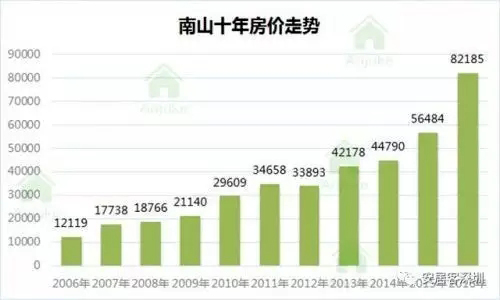

南科大所在的深圳南山区十年房价走势

目前的答案是校园东边的六栋十多层高的教师公寓。公寓有两居室和三居室的选择。两居是一百平米的样子，月租金不到两千人民币。教师公寓是名副其实的拎包入住，里面基本家具电器和生活用具一应俱全：大到空调冰箱洗衣机智能电视，小到锅碗瓢盆牙刷牙膏被褥拖鞋。水电网也都是包括的，只有大约煤气需要自己开通。而多数老师选择根本不开煤气，整年炊烟不举，因为楼下就是教工食堂。食堂一日三餐都是自助，早饭十块，午饭和晚饭二十五。有两点原因让我很信赖教工食堂：首先，饭点儿结束时，食堂师傅们自己也吃和我们一样的饭菜；另外，陈校经常在食堂就餐，本身是对食堂工作的最有效监督。这六栋教师公寓楼围成一个天井，正中心就是南科大幼儿园，有小型的塑胶跑道滑梯秋千甚至外教。对于孩子还小的老师这简直就是大写的方便：每天带娃到楼下食堂吃饭，吃完抹嘴送娃上幼儿园，走五分钟就上班，丝毫没有通勤之苦。

南科大提供的虽不是锦衣玉食，但完全可以保证衣食无忧。更奢华的物质带来的边界效益已经微乎其微，导致初次惊艳之后很快麻木乃至视而不见；而其高昂的维护成本甚至让人怀疑是否值得。对此我深有感悟：我们在美国十多年来先后买了四次房子，面积从小到大又变小，从联排到独栋又回归到联排，为的就是不想再操心院子的杂草和泳池的绿藻。人到中年，慢慢地发现，好多东西都可以比房子重要，而且重要程度与是否曾经拥有过有很大关系。Been there， done that（去过，ZUO过）的就没有原来重要。作为有文青情怀的理科生，文青那部分让我们看到是没有产权的公寓之外的诗与远方；理工那部分让们看到的不是一个静止的状态，而是其一阶和二阶可导性，以及导出的速度、加速度、以及加速度带来的推背感。

至于什么是最重要的，这个问题见仁见智。我也思考了很久，自己得出的答案是：家是。家和房子可以重叠，也可以完全是两回事。家的含义要宽广得多，能在其中获得温暖、慰藉、宁静、安全的地方就可以是家。只要爱人在一丈之内，茅草屋也可以是家；对爱旅游的人来说，四海都可以是家；对热衷事业的人，单位就是家。小万工文中很触动我的是一段话是她指出校训“自强不息，厚德载物”里“从来没有承诺我们有TOP级的物质生活，更多地是让我们无论在什么样的环境中，都不失德，都不丧志。”拆迁和彩票可以造就一夜暴富的新贵，而只有用心读许多年书才可能形成她文中体现的贵族般不凡的见识与自华的气度。校训的教诲正是让我们努力去做君子，做精神的贵族，去寻找和建设精神的家园。

南科大这六栋公寓很可能是世界上教授密度最高的地方之一：在80米乘120米的范围内住着近300名教授。早中晚老师们都聚在食堂，人气旺得很。大家经历相近背景相近，又每个人都擅长不同的兵器。这是真正意义上的往来无白丁。我脑洞一开甚至联想到：多年前西南联大在战乱之中诞生，在颠沛流离的逃亡中还大师辈出，跟当时许多才华横溢的人被迫聚居在一起朝夕相处交谈切磋想必也有某种关系。所以，深圳房子贵到买不起的程度也好，直接断了置业的念性，客观上把一群买不起学区房的教授们牢牢圈在一起，是促进思维碰撞产生火花的捷径，是一起构筑精神家园的良机。

**第十回**

**飘洋过海来看你**

2016年8月初，我结束了在国内的暑假兼职，回到在弗吉尼亚州居住的小镇。这个小镇人口不到五千，镇中心只是一个有4-way stop sign的十字路口。有一条铁路横穿小镇，可是上面内燃机车牵引的火车跑得慢悠悠的，感觉还没我百米冲刺来得快，跟中国子弹飞一般的高铁更加不可同日而语。与暑假在国内热闹的奔波截然不同，眼前的生活骤然平静下来，今年从夏到秋感觉过得尤其慢。日历缓缓翻到了11月4日，收到南科大邮件通知：我通过了青千函评，两周后到南科大参加校内组织的预答辩演练。

这个预答辩是日臻成熟的青千引进工作中的一环。青千越来越受到各高校重视，其原因很多，南京工业大学校长黄维院士对此做过精辟的分析。他认为青千“入选者年龄分布合理、学缘结构良好、阅历丰富多元、科研潜力巨大，是一流师资队伍的生力军。”从年龄来讲，三十到四十通常是学者创造力最旺盛的时期，也是青千的目标年龄；学缘大致可以理解为学术血统或血缘，英文对应的是pedigree。青千要求海外三年以上经历，国内毕业的博士做得再好也必须外放，这使得学缘多样避免近亲繁殖。据教育部统计，中国将在2018年之前从最大的人才流出国转为人才回流国。加上青千是双向选择的结果，有市场机制的特性，而且传统名校编制迅速趋于饱和，这给许多非985和非211（“双非”）高校带来了逆袭的机遇。所以，黄维院士主张“高校应当抓住高层次人才回流机遇，主动作为。”

事实也的确是这样，主动作为的高校比如中科大、华中科大、南科大都相继摸索出了青千引进的工作套路。如果还用学术江湖的说法，这个套路就像比武招亲。这些高校在三月份甚至前一年的十二月份就开始摆擂台，先召开一个青年学者论坛，学校提供盘缠请各方青年才俊来自己学校看看，集中做学术报告展示功夫，学校从中预筛选中意的女婿们。经过这个相亲见面会互相看对眼儿的就先订婚（签意向性协议），依托学校在六月底七月初向岳父老泰山（中组部）提交青千申请。中组部委托江湖中已经成名立万的高手对申请的本子进行函评，函评通过的准女婿通常要在依托学校接受礼仪培训（预答辩），保证在进京见公婆（正式答辩）时不怯场不超时。公婆首肯之后会张榜天下（公示），没有异议之后有彩礼送上：个人补助50万和启动经费200到300万。这些钱往往不及地方配套给的多，但这是由中央财政直接支持，像是全国人民凑份子给的，是一种荣誉，也是一种鞭策。

根据通知要求，“申请人以PPT形式进行现场汇报，汇报时长15分钟，回答问题10分钟。汇报重点内容包括：① 教育及科研工作经历；② 主要学术成绩或技术创新成果；③全职回国工作设想；④ 用人单位支持保障开展科研情况。”以我行走江湖这些年参加各种武林大会的经验，45分钟的正常job talk和3分钟的soundbite都比15分钟好做。45分钟的篇幅可以从容地起承转合讲故事；3分钟则像个广告，主要目的是引起兴趣而不是讲清楚问题，内容可以炫可以装可以煽可以讲情怀。最难的是15分钟：讲故事呢不好讲深讲透，炫技呢时间又太长容易审美疲劳甚至露出破绽。材料的取舍本身已经不易，再把要求的四条讲清楚更加困难。

况且，我给自己提了更高的要求。不止一个同事说我申青千over qualify了，可越是这样就越要over prepare， over deliver。由于自己终身教授的身份，必须在宽广度、成熟度、全局性、前瞻性显示出与博后的区别。答辩不能局限于若干独立问题的孤芳自赏，更重要的是要让评委相信我可以迅速独树一帜建立根据地，把一个专长的学科领域做到国内领先世界前沿。我最后思考的结果是打出“精准雾化”的鲜明旗帜，用这个概念来统领过去、现在和将来的研究。大致逻辑轨迹是这样：国计民生（从制药到杀虫）对精准雾化有强烈需求，而我所练的泰勒锥是精准雾化的神器，修炼多年有独门心法，也解锁了许多招式变化，可以帮助解决国计民生的若干关键问题。PPT初稿经自己批阅两周增删十次，系内反馈再修改两次。我为每张PPT都写了中文脚本，微调几次定稿后朗诵录音，有空就听。22张一共3500字，语速300字每分钟，加上视频，14分钟结束，误差不超过30秒。可以说自己对每个字每个停顿都了然于胸。不禁想起了那首《飘洋过海来看你》，真可谓是“为了这次相聚，我连见面时的呼吸都曾反复练习。”

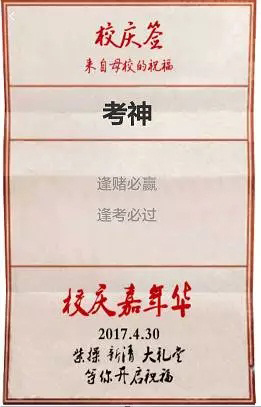

在进京答辩前夜，陈校设宴给十八位南科大准女婿动员壮行。陈校微笑举杯，如炬的目光从他眼镜上缘投射出来环视大家，鼓励我们答辩时表现出朝气、自信、意气风发，让评委看到青春、未来和希望。

2016年11月20日，星期日。早八点，一辆中巴车停在南方科技大学专家公寓门口，十几个青千候选人鱼贯上车。带队的是人力资源部的龙老师，她看起来很像一个小学班主任，拿着名单清点人数，确认没有失散的孩子之后出发前往机场去北京参加答辩。虽然大家以前基本互不相识，但毕竟还是中组部眼中的“青年”，所以也很快熟络起来，还有人拿出零食饮料分享。一时间中巴车里人声鼎沸，颇有去郊游的气氛。

三个小时的飞机把我们从有蓝天白云的温暖深圳带到了雾霾压城的寒冷北京。入住的酒店名字很气派，叫做万世名流。我第二天答辩，呆在房间里心情莫名的烦躁。我认定这是孤独感在作怪，于是打电话给在北京的阿萌说你能过来陪陪我吗？

阿萌是我高中同班同学。我和阿萌一起做过许多可以称为浪漫的事。高中时住校，只有周末才能回家，阿萌总要蹭我的自行车（现在大家都管这叫单车了），后座上的阿萌手永远抓着我的腰。高一时我做语文课代表，每星期全班的周记都要交到我这儿来。我会先找到阿萌的，欣赏那一手娟秀小字。我和阿萌甚至在同一张床上并排和衣而卧多次，要么是一人一个耳塞静静听歌，要么是相视而笑讨论学校春晚一起演节目的细节。此时担心我人身安全捏一把汗的读者请放心啦，阿萌是个如假包换的爷们，只是声音比较细、字体比较清秀、话比较多、不会骑单车而已。

**第十一回**

**上会**

阿萌大学去了同济，常有书信往来，寄来的信封上的校徽怎么看都像三个豆芽菜一样的小人儿在划船。他本科学的是给排水专业，研究生考到清华环境系，又在一起度过了两年时光。跟阿萌在一起很轻松，因为他自己是话痨，多数时候主要听他眉飞色舞地讲就可以了。他的存在是我小而确定的幸福：高中或大学郁闷的时候找阿萌排解，他总是随叫随到，而且几句话之后就变成听他吐槽而忘记了自己的不快。现在阿萌定居在北京西南角，而万世名流在东北角。他接了我的电话二话不说就横穿京城赶过来了。过了这么多年，阿萌还是我的那个小确幸。

和阿萌在酒店餐厅坐下时才意识到，两人恐怕有十年没有聚在一起吃饭了。他刚生了老二，声称是计划外的（但有某位犀利的同学评论道：只要没有打掉，都是计划内）。阿萌言谈举止间那颗曾经骚动的心显得安静了许多。提起新添的千金，他那满脸的笑容、温柔和幸福让我感觉熟悉又新鲜。由于阿萌的专业，我们还谈到了雾霾和环境。他告诉我，中国对环境的治理有切实的决心和人事布局，例证是他读研时候的环境系主任被不同寻常地擢升为清华校长和环保部部长。我对雾霾治理和控制气候变暖这些宏观环境问题也很感兴趣，因为自己有些近乎科幻的想法。比如，也许可以用无人机带着成百上千个泰勒锥释放带电量很高的成核种子(nucleation seeds)去捕捉雾霾颗粒进行雪崩式反应，成为污水雨沉降。另外，还可能用很多泰勒锥在大洋高空形成无数盐颗粒组成明亮的人工白云（叫做“云层增亮”或者marine cloud brightening），这样可以反射太阳光减少地球吸热。九点多和阿萌告别，天空中已经飘起了北京2016年冬天第一场雪。

11月21日早上8点，在陌生而又熟悉的城市醒来。对着镜子，穿上西装，皮鞋擦亮。男人的西装很像女人的高跟鞋：穿上的感觉并不怎么舒服，却是改善外形最有效的神器；这个矛盾也在宣示着对某个场合或某个人的重视。我是不懂西装的，但只需听行家的意见就好。读博士的时候有个同系的师兄，我们称他为“不忘”吧。不忘师兄毕业前要去华尔街面试，他夫人丽珊带我们一起去给他买正装。到了mall里也不需要逛，直奔布如克斯兄弟(Brooks Brothers)。神奇的是，商场里服装品牌数不胜数，偏偏这家的衣服可以让你很自然地联想到银行家和律师，连这家童装都透着浓浓的私立学校味道(preppy)。丽珊托着一件衣服说：他家的免烫衬衫真的是免烫的。从此也就简单了，衬衫西装都在Brooks Brothers解决。

11点来到北京会议中心。报到，领了胸牌。工作人员是学生的模样，很真诚地说：祝你好运。会场像个酒店，大堂里很多人，其中西装革履的“青年”大都是来答辩的。这些人的博士加博后经历都在十年左右，而展现才华的时间只有那十五分钟。真可谓台上一刻钟，台下十年功。

在技术层面上，中组部委托国家自然基金委(NSFC)来做函评和会评的工作。美国自然基金委（NSF）也分函评和会评，但通常是同一拨评委：第一步先下载本子审过给出评语并打分定下大致名次，第二步评委聚到阿灵顿NSF总部在一起开会讨论做排名的微调。也就是说，美国所有本子都上会，但只有百分之十可以过关。而中国正好相反：函评的是小同行，会评则是大同行，两拨评委不见得有重叠；而且函评要刷掉一大半，只取计划名额的百分之一百二十左右数量的本子上会，所以上了会就是把握比较大的。这也符合国内“上会”的规则，要讨论的议题通常都是会前对各个方面已经做通了工作，达成基本共识的情况下才上会。

答辩分为24组，多数是在二楼的几个小会议室里。我在工程二组。到二楼逛一圈找到了自己所在会议室的位置，接着走到这一层的角落，找到一把椅子坐下。旁边的会议室是信息三组。我拿出电脑，再默读几遍脚本，考虑一下可能会问到的问题。不过我的主要注意力都被旁边的几个人吸引了。经过几分钟观察，可以判断他们是一个学校的；那个背着手的应该是人事主管领导，旁边两男一女是他下属。估计他们学校的候选人正在里面答辩，而他们讨论的是怎么做好外围和服务工作。古人说功夫在诗外，而各种评审较量得也绝不仅仅是答辩本身。我正观察得津津有味，有人拍了拍我，是学校人力资源部的戴副部长带着两个女同事。我这才想起来，原来俺也是有团队撑腰的啊，而且我们女同事比你们还多一个呢，顿时底气足了很多。年轻的副部长很善解人意，他招呼我去喝咖啡，闲聊打发剩下的时光。他告诉我说陈校正好是工程二组的组长。

评审小组是双组长制，到我的时候，陈校请另一个组长主持。一切都非常流畅，直至第一个视频——点击不动啊。这有些意外，因为答辩通知里讲了PowerPoint软件的版本，而我们也用那这个版本测试过播放无误。但此时只能随机应变，大致描述视频展示的现象。这对节奏还是有些影响，不过此时过度准备的好处就体现出来了：我对这些内容如此熟悉，可以有多种说法连接补救，所以很快就回到正轨。倒数三张ppt的时候工作人员默默举起一个牌子，上面写着“还剩三分钟”。于是很从容地讲完最后几张，估计14分半的样子，刚刚好。进入提问环节，陈校出会议室回避。组长微笑着直奔主题：青千的名额很宝贵，像你这样有tenure的情况比较少见，你给大家说说为什么想回来？言下之意是你是认真的吗？这个问题很好回答，而且昨晚刚和阿萌详细解释过一番。我简单说了三个理由：一、中美科研投入此消彼长，美国的实际人均投入在逐年下降，而中国迅速上升；二、在一项事业的边缘与核心的感受和情怀很不一样，比如最近天宫二号成功发射，我在美国看大家刷朋友圈，而一个大学同班同学是在发射指挥大厅里发朋友圈；三、父母老了，不宜远游。评委多是有海外经历的人，对我说的应该有共鸣。一位评委问起我的CAREER Award，我们还从资助金额和入选率角度把NSF CAREER与国内NSFC的几个青年项目试图对标。另一位评委问起我想做的海洋云层增亮控制全球变暖的课题，我讲了思路，他说这个很难；我说没错，这个问题的确难极了，同时也重要极了，而青千应该去尝试解决重要且难的问题。回想起来，那一刻我的神情应该是蛮倔强的。

十分钟的提问环节很快结束，我出来与陈校握手道别。答辩之后返回美国，这里已经开始进入假期模式（holiday season）。先是11月下旬的感恩节，学校通常要放假一周，之后两周就到了期末考试，12月中旬大学和小学都放寒假，紧跟就是圣诞和新年了。这两周假期在这个冬天将显得格外漫长，我们应该怎么去度呢？

**第十二回**

**友直、友谅、友善厨**

每年节日长假的时候就要琢磨去哪里。读博士时前几年娃还没有出生，那时和媳妇的玩心很重：可以花年收入的四分之一去背包游欧洲，可以期末翘课去坐十一天的加勒比邮轮。开始工作的时候在奥兰多，与迪斯尼乐园、环球影城公园、海洋公园同城紧邻，并且美国最美的白海滩之一也在九十分钟车程范围之内。随着时间的推移，能让自己心痒、十分想去的地方越来越少，我们也越来越头疼下次度假该去哪里。

另一方面，今年这次假期与往常不同：由于对未来的不确定性，两个人都有些心不在焉，也没有什么心思去积极计划这个假期的行程。可随着年底逐渐接近，如果两周都憋在这个小镇里也不是办法。十二月中旬和媳妇商量去度假的目的和目的地，一致同意要吃得好、玩得好，甚至前者更重要些。有了这个指导思想，我们决定去东北部访友，尤其是厨艺好的朋友。此外，我们还打算带娃再回一趟耶鲁。

如果美国也有龙脉的话，我想那应该是在东北部，尤其是纽约、新泽西、康州、麻省四个紧邻的州。从历史来看，独立战争的第一枪是在麻省，康州是宪法之州，而纽约更是美国的象征；从教育来看，常青藤的五条大藤中藤都在这里；从经济来看，这四个州的GDP总量与德国等量齐观。最重要的是，几个多年的好朋友也居住在这里。怎么定义“好”呢？那就是可以我们一家三口都那里吃住而不觉得不好意思。如果每个人朋友圈都有中委会，那好朋友就是常委。几个电话一打，几个常委刚好在圣诞节前后都不出远门，行程就这么敲定了。圣诞节前三天先飞到波士顿到一个前同事家里，他夫人给我们做正宗的哨子面，那是从面粉开始，和面醒面，压面片，再压面条。他们夫妻俩忙活，我和媳妇咽口水，娃和他家三个孩子快乐地围着我们带来的亚马逊人工智能助理Echo Dot叽叽喳喳问话。次日一起去了麻省的一个室内水上乐园，孩子们乐不思蜀。12月24日中午告别他们前往位于康州海港城市纽黑文的耶鲁。

我和媳妇在耶鲁前前后后呆了六年，娃就是在耶鲁医院出生。娃没满周岁的时候我们就毕业离开了，现在娃已经八岁多，我们也有近八年没有回来过了。记得一次有人问了我博士母校后就笑道：那你是不是很会吼？我想了几秒才得到了它：Yale和yell（吼）发音相近，还跟媳妇讲了这事儿。后来娃犯熊媳妇冲她凶的时候，娃说妈妈你能不能不那么大声吼啊，媳妇回答：为娘做不到啊，我上了Yale就可以冲你yell，有本事你将来上Yale可以yell回来。

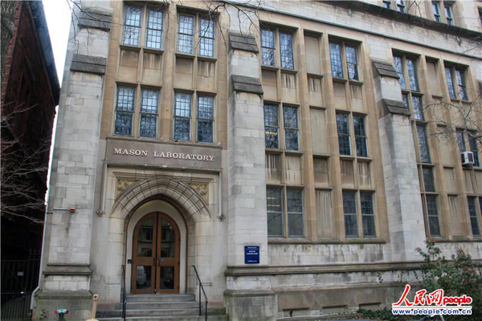

耶鲁大学—梅森馆

耶鲁最核心和精华的建筑是在Sterling图书馆周围：如果要拍美版的哈里波特，在这里取景肯定没错。但我更想看的是曾经战斗过多年的地方：梅森馆(Mason Lab)，也是机械系、化工系、环境系共用的系馆。我在梅森馆留下了太多记忆：一楼休息室里的微波炉几乎是每天中午热饭都要用的，与不忘师兄丽珊夫妇一起吃过很多次午饭；我曾做过工学院研究生组织的CEO(Chief Eating Officer)，负责置办周五下午happy hour的食物，在梅森的lobby里给同学们serve晚餐。梅森馆旁边是校医院分部，我跟娃讲：你还在娘胎里的时候第一次B超就是在这里，我们看到屏幕上一个灰点迅速收缩，那就是你十几周时候小生命的心跳。梅森后门出来是庙街(Temple St.)。庙街上的“还能害得你好”宿舍楼(Hellen HadleyHall)是中国留学生扎堆的地方，发生过许多不大不小的传奇和八卦故事。有个狭小的胡同横穿庙街通向附近的香港店食堂，每到中午，计算机系的若干中国学生会成群结队穿着黑衣像黑社会一般鱼贯穿过那个胡同去吃午饭（或早饭），差不多可以凑成庙街十三少。梅森馆所在的房山路(Hillhouse Ave)被狄更斯和马克吐温不约而同地誉为美国最美的路，没有之一。逛完了这美国最美，天色渐晚，我们也必须继续赶路了。心中颇有些不舍和留恋，因为如果真的海归了，还真不知道下次故地重游会是什么时候。

但想起下一个目的地，我们还是满心欢喜，因为今晚及今后的五天将在丽珊家度过。有一种朋友的家里始终散发着独特的吸引力：他们家开party是大家都会排除万难参加的，就算不开party也是要找借口讨扰的，不为别的，就是因为和他们心有灵犀。而通向朋友心灵的是——味蕾。不忘师兄和丽珊就是这样一对与很多朋友都有灵犀的一对神仙眷侣。他们都是四川人，他们家的火锅party就是大家的节日。2003年在他们家第一次知道，火锅蘸料可以是简单粗暴的麻油、蒜泥加味精，就这样霸道地把我征服了。（我才不管谁说味精有什么不好的：咸靠盐，甜靠糖，鲜自然靠味精，其他鲜味来源都是谷氨酸钠的马甲而已）。被征服的不仅仅是我，还有一批吼校友。毕业之后大家都分散至各地，但微信兴起不久，丽珊就建群把大家统一起来，我们很开心地重新紧密团结在丽珊和不忘师兄周围。每年夏季丽珊要组织大家和吼二代召开为期一周的聚会，大人和小孩都圈起来培养增进感情；每年冬季，丽珊还会做四川辣香肠派送给大家，北美包邮。

平安夜天黑之后到了丽珊家。进屋之后香气袭人：一长条餐桌，两个大火锅。丽珊的父母也在，经过多次蹭饭，彼此也都熟识了，一时间饭桌上觥筹交错一派祥和的节日气氛。大快朵颐之后又有蛋糕端上来，原来今天正好是丽珊爸爸生日。伯父浓眉大眼，皮肤好的很，让我不由得猜测辣椒一定会有显著的养颜作用。蜡烛点上，生快唱响，烛灭鼓掌，蛋糕分享，做葛优躺。

媳妇跟丽珊边嗑瓜子边聊起我海归的想法：她发愁一方面很珍爱自己那份AP的工作和在美国简单的生活，另一方面也知道金牛座的我倔强起来的想法怕是拦不住的。媳妇能听进去话的人不多，而丽珊的意见媳妇一直很看重。我猜一方面是因为吃人家嘴短，更重要的是丽珊不仅厨艺高，口才也极好，见地独到深入。丽珊旗帜鲜明地表示理解媳妇也理解我的想法，而且非常支持我走这一步，为我这个机会高兴。她认为海归高校与归公司不同，风险要小得多。丽珊还强烈建议一家人要尽量在一起，一个先归一个留守的做法并不可取。丽珊一席话让媳妇想法有了松动，开始由不反对转向支持。

聊天的时候网路电视放着《锦绣未央》，此剧服饰华美、剧情拖沓，非常适合作背景画面和声音，隔几分钟扫一眼插值脑补也不会缺失关键信息。很快我们就根据剧情归纳出一个结论：秀恩爱的肯定不长久。我在沙发上舒服地摊开时也深感度假与旅游的不同：年轻时的旅游是不停地走马观花到此一游留些照片；现在的度假是放松地享受好朋友在一起的时光，聊着各种有聊无聊的话题都一点不觉得无聊。

12月29日清晨在师兄家醒来，发现微信里好几条消息，都是来自国内的同事同学，内容也都是新鲜出炉的青千公示名单。今年青千3048人申请，约800人上会，最终公示601人（最终入选590人——编者注）。在美国，生日是个人隐私，至少年份是不公开的。而在中国因为年龄是各种人才计划和职务升迁的杠杠，生日与国外工作单位一起成为青千公示的两个重要信息之一。找到了自己的名字，虽然是意料之中，但公示之后就意味着海归的天平已经不可逆转地向东方倾斜。

**第十三回**

**七颗龙珠**

度假回来已经是2016年底。2016可以被四整除，所以是闰年，英文叫leap year。Leap也有大跃进的意思。2016是个多么难以置信的年份，许多匪夷所思的事情都发生了，比如英国脱欧、川普当选、小熊夺冠。那么海归呢？能否实现海归愿望需要集齐七颗龙珠。数了数，我已经有了六颗：

第一，获得了媳妇的支持；

第二，这是一所崭新的学校，没有历史包袱而且理念先进，追求的是小而精而非大而全；

第三，和陈校是小同行，所属的力学系是学校计划打造的优势学科；

第四，学校的配套完善贴心让人无后顾之忧；

第五，深圳是个比自己更年轻的移民城市，但高等教育是短板，政府投入慷慨；

第六，拿到了青千的帽子。

还缺第七颗：一个核心团队。于是我微信小杨。小杨是我的第一个博士。记得六年前我奔赴奥兰多去做AP之前，我的博士导师跟我谈话，告诫我招第一个学生一定要慎重，因为这个学生可以成就AP的tenure，同样也可以毁灭AP的tenure。当时我托朋友在国内各大BBS站点贴了招生小广告，十几份申请中小杨的简历脱颖而出：不仅仅是因为他是中科大本科并且当时已经在美国的佛罗里达州立大学，更因为他的名字拼音跟我一模一样。跟他电话面试了一下，觉得这个学生挺稳重，应答得体，于是当即录取。我很幸运，小杨成就了我的tenure。我做的流体力学可以很工程，也可以很物理，还可以很数学。作为导师，我工程方面的想法很多，但理论方面的物理和数学需要能静下心来的学生去琢磨和推演。小杨本科是物理专业，他的物理素养和数学功底在工程问题面前显得十分游刃有余。机械工程的专业课他没有修过，但稍事准备就轻松通过博士资格考试。我们实验中发现的有趣现象，他找到了数学模型做出了精彩的解释，立即把这项工作拔高了不止一个档次，最终发表在Physical Review Letters上，还被选为封面文章，着实令人骄傲。他博士期间的课题之一是用显卡(GPU)作为并行计算工具去算静电喷雾中的多体(N-body)问题，而恰巧他快毕业的时候，我的一个高中同学在金融公司IT部门需要GPU方面背景的人，小杨就不到四年毕业直接去那个公司了（工资马上超过他的导师）。本来我觉得这是很好的安排，因为科大学生做金融的很多，小杨编程也颇有天赋，以此切入金融行业似乎比传统的机械工程更有前途。而他工作后显得不那么开心，最近两次交流发现他也有和我一起海归的意思。这次跟他好好商量了一下，他说下决心归。真好。

然后我又微信小李。小李是我的第一个博士后。她的博士导师安教授和我合作多年，我的第一个NSF就是在他倾力帮助提携下完成的。小李博士专业是材料，而我们也用泰勒锥打印一些新材料，小李是实验室唯一既懂泰勒锥又懂材料的多面手。她动手能力很强，而且做事干净利索，善于多线程同时推进，实验室里事无巨细她都可以管得井井有条。我转到VT的时候，她家刚在奥兰多已经买了房子，就没有跟我过去。这次再跟她说海归的事情，她居然很干脆地答应了。真好。

我的团队2012年与时任能源部长、诺奖得主朱棣文博士合影

天下大事，合久必分，分久必合。如今我与小杨小李分别两三年了，都很怀念当时一起在实验室摸爬滚打通宵达旦的奋斗时光，虽然钱不多而且工作很辛苦，但是气氛愉快融洽，并且有蒸蒸日上日新月异的美好感觉。现在，我又重新找到了左膀右臂，第七颗龙珠已然集齐，可以召唤神龙实现这个海归的愿望了。

**第十四回**

**最后一课**

2017年4月27日，下午两点。我看着眼前流体力学课上的五十来个学生，心情有些复杂。我把上课是当作一个TVshow，每节课都是一个episode，每集都尽量讲一个自洽的故事，同时和前后集乃至整个学期都有不同程度的桥段(arch)衔接。而且故事也尽量安排有层次有悬念有转折有诙谐有煽情。每节课开始还要做Previously(前情回顾)来为下面的内容做铺垫。如此动脑筋是因为一个称职教授的核心能力之一是要能“holdaudience′sinterest”（保持听众兴趣），而在漫长的一个学期保持兴趣是需要统筹编织的。今天我在黑板上写下“Season Finale”（本季大结局）。有几个学生吃吃笑了：他们只以为我是模仿美剧的说法来指最后一堂复习课，却不知道这也是我在VT乃至美国讲台上的最后一课。在美国做老师整整七年，仅流体力学这门课就教了上千学生，眼前这是最后五十个。

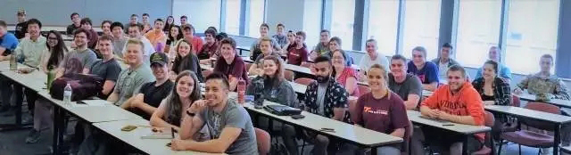

与在VT教的最后一批学生合影

几年前曾有一个在国内高校做老师的高中同学来奥兰多度假，中途好奇来到我的课堂，之后在朋友圈发了如下文字：“下午旁听邓老师上课，颇有感触。本科生的一门基础课，热传导，应该属于不那么有趣的典型工科课程，也有很多公式，在我们的课堂上应该是没多少学生愿意抬头听的课。我看到他们上课的状态是，每个学生都在听课、做笔记，没有任何人交头接耳讲话，教室非常安静，邓老师那么温和的轻声说话在最后一排也听得非常清楚。同时，很多学生随时举手提出自己的疑问或回答老师的问题，整个课堂是非常融洽的讨论问题的气氛，既安静又热烈。我上了那么多年课从来没有遇到这样的状态，通常是相反：老师讲课时候学生在下面小声说话或做自己的事情，一说要提问，全场立刻鸦雀无声没人回应。这样的差别到底是什么原因造成的？”

我想这里面很大的一个原因是个人兴趣和对教育机会的珍视。美国学生在童年的时候通常都是父母的蜂蜜宝贝和甜心，但一上大学后好多父母就突然撒手不管了，连学费要自己想办法。打一两份工的学生很普遍，有些学生甚至要先去当三年兵再享受政府提供的学费。加上在美国选专业和换专业都是完全自由自愿的，所以他们来到教室是因为最初的兴趣并且为止付出了代价，没有理由不去尝试投入。当然学生的初心能否保持很大程度上看老师的教法。

学生在新上每一门课之前这方面都是白纸一张，在这些白纸上留下什么痕迹是属于教授的绝对权力。学生应该尊重教授的权威，而教授自身更应该对这种权威有所敬畏。与其他享有绝对权威的角色（比如美国医生和Google）一样，老师最起码的准则是Do no harm (不做伤害)。一个学生很容易因为一个老师而喜欢或者憎恶一门课，而且这种感觉是会持续一生的烙印，因为那是第一次。教学在战略上是严肃的事情，但在战术实施上可以是活泼的，课堂气氛轻松愉快的对师生的心理健康都有好处。做到这点其实不难，选自己真正感兴趣的教就好了。就像看到某个人谈起他或者她的爱好眉飞色舞如数家珍，具体内容不重要，但那种热情和激情是有感染力的，是可以让听众爱屋及乌的。我非常开心的一件事就是经常能看到学生在匿名的教学评估里说他们能感到Prof. Deng是genuinely passionate about thesubject(真心喜欢该科目啊)。所谓己所不欲，勿施于人啊。

任何人与人之间的关系，不论是师生还是夫妻，对期望值的控制都至关重要。伤害不是来自买卖，而是来自于期望值的落差。给他们上第一节课的时候我先给他们讲了MIT对机械工程系毕业生的调查结果。调查的内容是问毕业生在工作中那些知识和技能是常用的。不出意外，“软实力”类比如独立思考、系统思维、工程分析、沟通、团队合作等等是每天都要用到的，而具体科目用得要少得多，尤其是流体力学，一年就平均用到一两次。我问学生这意味着什么？一个学生怯生生地说：“Useless（毫无用处）？”我说对，也不对。那些软实力类似于健身之后的马甲线，绝不是凭空来的，具体的科目是训练各处肌肉的跑步机杠铃和游泳池。这门课也许是最难的器械之一，你们要准备流汗受折磨。随后我微微一笑：“It is my job to torture you（虐你我乐意）.”这番预防针也让学生对后来无穷无尽的数学公式有了心理免疫。

可惜的是，在美国学术圈“重经费、轻教学”的趋势愈演愈烈。刚入职的时候系主任就明确讲：教课要花最少的精力，从而挤出尽可能多的时间去写本子出差跑项目。现在多数学校在评终身教职的时候经费可以一俊遮百丑，只要钱拿得多，教学、服务哪怕马马虎虎也可以顺利通过。在如此的指挥棒下，许多教授不愿意也不敢花心思去上课，甚至经常让研究生或者博后代课。我反对对教学的忽视，因为教书是老师的本分。大学和医院相似，两者都是试错成本极高的地方。教授不用心教书而一味追求经费就相当于医生不用心诊断而开高价药，都是有昧良心的做法。面对这群目光清澈的孩子，我没有办法不认真用心对待他们。

复习课结束，我用一黑板归纳了课程的框架，如果要起个朋友圈文章的名字话可以叫《一张图看懂流体力学》。课后与学生集体合影，拍拍手上的粉笔灰，看它们在下午的阳光中飞舞，脑海里迅速估算了一下空气中尘埃的雷诺数，然后转身绝尘而去。留在身后的是在美国十五年宝贵的青春，虽然有些不舍，但一个校庆福签说的好：“所有的失恋都是为真爱让路”。好聚好散，我要回故土去寻找事业的真爱了。

最开始和朋友提起海归的想法的时候，不少人用中年危机或者七年之痒来说事儿。甚至有朋友打趣道：矫情啥，生个老二，包治百痒。而自己知道，这一眼可以望到头的生活绝对不是每天早早起床的动力。决心下了之后想把思路梳理得清楚些，就打算在学期结束之前完成这个连载。这相当于给自己设了十几个deadline，因为每周日之前必须更新，不少群众瓜都早早切好了呢。写的时候发现自己非常享受慢慢码字的时光，而时间的确像海绵里的水，对自己喜欢的事总是挤得出来。

我喜欢老师这份职业如同人们喜欢音乐，很重要的一个原因是其中的节奏。除了一年分两个学期，还有基金季、招生季、考试季、毕业季、论文季等定期主要工作。每周上课时间更是固定的边界条件，一周的备课答疑都要围绕着上课来。这些节奏看似限制了许多时间发挥的自由，但是就像律诗的字数和平仄一样，在规则下的创造力与美并不见得会被抹杀，反而可能会被激发。每周更新《海归记》也是这节奏里的音符。

我和很多我的小伙伴们都是生于一九七七。那一年，刘文正主演电影《闪亮的日子》，他请罗大佑谱写了同名歌曲。用这首歌的大意来做结尾也蛮合适：过去四个月都在见缝插针写《海归记》，仿佛是“我来唱一首歌”，那首海外游子都曾默念过的古老的归去来兮的歌。一个人静静敲动键盘颇有“轻轻地唱”的感觉，而亲爱的你们也非常体谅地在票圈“慢慢地和”。写与读的时候你我也许问过“是否你还记得，过去的梦想”。如果说长期在海外的“你我为了理想，历尽了艰苦”实在是一点不为过：求学、求职、绿卡哪一样不是咬牙拼出来的啊。这些经历让“我们曾经哭泣，也曾共同欢笑”。我知道“你会记得，永远地记得，我们曾经拥有”，而且会继续拥有——闪亮的日子。

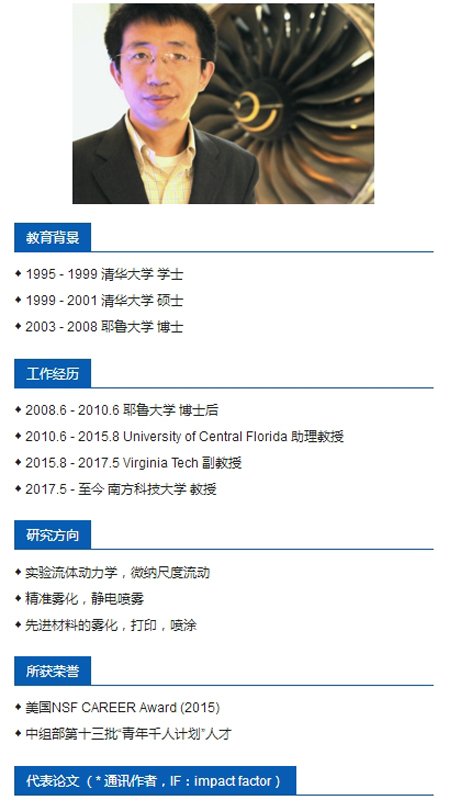

**邓巍巍**在南方科技大学力学与航空航天工程系的主页
